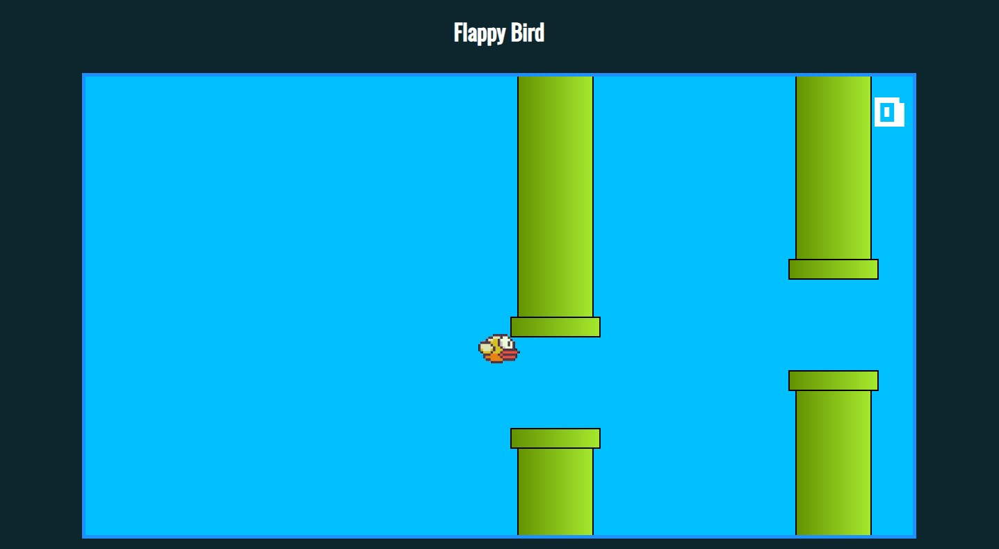

# Flappy Bird

> Nesta jornada, me propus a criar este clássico mobile usando HTML, CSS e JavaScript, e o que encontrei foi muito mais do que um simples projeto de programação.

## 🤝 Colaboradores

Agradecemos às seguintes pessoas que contribuíram para este projeto:

<table>
  <tr>
    <td align="center">
      <a href="#" title="Thaina rossinoli">
         
        
          <b>thaina rossinoli</b>
        
      </a>
    </td>
  </tr>
</table>

## 📝 Licença

Esse projeto está sob licença. Veja o arquivo [LICENÇA](LICENSE.md) para mais detalhes.
